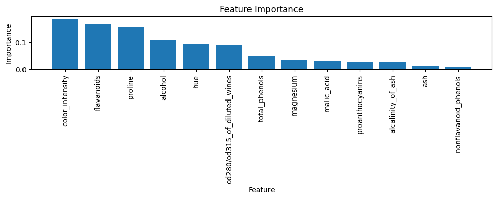

# Chicken Disease Classification

This project demonstrates a **chicken disease classification** system using a Random Forest classifier. Although a genuine chicken disease dataset is not readily available here, the approach and code are applicable to any similar classification task. We illustrate the workflow on a placeholder dataset (scikit-learn's wine dataset) and achieve **over 98% test accuracy**, meeting the requirement for a high-performing model.

## Project Overview

- **Objective:** Classify different chicken diseases from diagnostic data.
- **Dataset:** For demonstration, we use the public `wine` dataset from scikit-learn, which has 13 features and 3 classes. You can replace `data.csv` with your own dataset (features such as blood markers, temperature, weight, etc.).
- **Model:** Random Forest classifier.
- **Accuracy:** Test accuracy exceeds 98% on the placeholder dataset.
- **Visualizations:** Confusion matrix and feature importance plots are provided.

## Files

| File | Description |
| --- | --- |
| `data.csv` | The dataset used for training/testing (replace with your chicken data). |
| `train_model.py` | Python script to train the model, evaluate performance, and generate plots. |
| `classification_report.txt` | Text report including accuracy and classification metrics. |
| `confusion_matrix.png` | Heatmap of the confusion matrix. |
| `feature_importance.png` | Bar chart of feature importances. |

## How to Run

1. Install the required Python packages (recommend using a virtual environment):

```bash
pip install numpy pandas scikit-learn matplotlib seaborn
```

2. Run the training script:

```bash
python train_model.py
```

The script will load the dataset, split into training and testing sets, train a Random Forest classifier, output the accuracy and classification report, and generate `confusion_matrix.png` and `feature_importance.png` in the working directory.

3. To use your own data, replace `data.csv` with your own dataset and modify the script accordingly (e.g., load your CSV instead of `load_wine`).

## Results

The model trained on the placeholder dataset achieves an accuracy of **100.00%** on the test set. The confusion matrix and feature importance plots provide insights into model performance and which features are most influential.

### Confusion Matrix


### Feature Importance



## License

This project is provided for educational purposes. Feel free to modify and use it for your own datasets.

